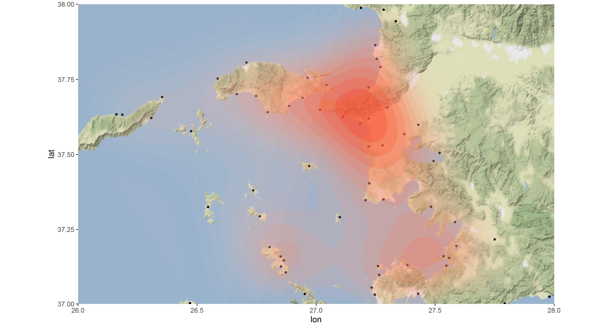

# Mapping with R - ggmap

Code I created for a master's assignment to show how to use <a href="https://github.com/dkahle/ggmap">ggmap</a> with R.

While working in R Studio with data that has a spatial reference, it can be extremely useful to plot it on a map. Combining data visualization techniques with a map can provide a fruitful insight into your data, even if your main interest is not spatial data analysis. Moreover, considering the vast possibilities offered by ggplot2, plotting your data on a map or satellite imagery may allow you to spot new details that you may not have been able to identify before. This little tutorial will help you with the basics.
 
In order to do it, I have used data from <a href="https://darmc.harvard.edu">'The Digital Atlas of Roman and Medieval Civilizations (DARMC)'</a>. It is a project hold by Harvard University and its aim is to provide "freely available on the internet the best available materials for a Geographic Information Systems (GIS) approach to mapping and spatial analysis of the Roman and medieval worlds". From the data available, I have been working with the Geodatabase of Ancient Ports and Harbors (version 1.1) (A. de Graauw, 2014).

You will use <a href="http://maps.stamen.com">Stamen Maps</a> and <a href="https://www.google.com/maps">Google Maps</a>. Please note that Google has changed its <a href="https://developers.google.com/maps/documentation/geocoding/usage-and-billing">Geocoding API Usage</a>.  
 
 

